

# **Paper Review**
## KGAT: Knowledge Graph Attention Network

M1 Yang Boming

---

<!-- _footer: "https://velog.io/@jbeen2/CS224W-17.-Reasoning-over-Knowledge-Graphs" -->

# Background
## Knowledge Graph

1. Heterogeneous graph: node or two or more types of edges.
2. node becomes an **entity** and edge becomes a **relationship**.
3. Traditional Graph $G=(V,E)$ Knowledge Graph 
$G=(V,E,R,T)$
Nodes, Edges, Node type, Relation type.

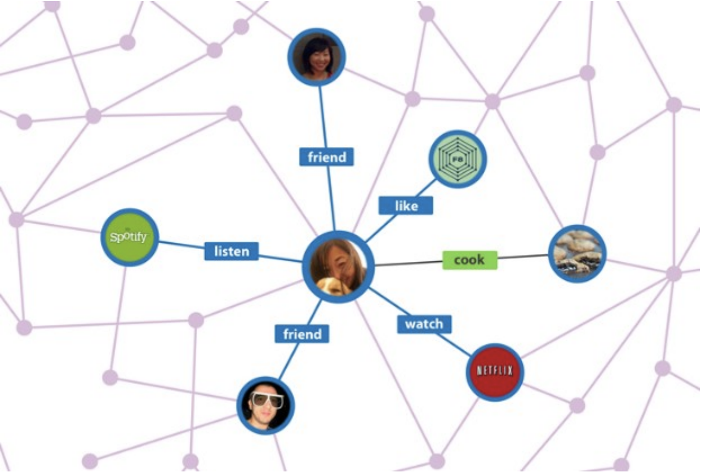

---

# Abstract
## Knowledge Graph Attention Network(KGAT)
1. Provide better recommendation with item side information.
2. KGAT model, which achieves high-order relation modeling in an explicit and end-top-end manner under GNN.
3. Conduct extensive experiments to demonstrate the effectiveness of KGAT and its interpretability

---
# Task Formulation
## Collaborative Knowledge Graph (CKG)
- CKG: which encodes user behaviors and item knowledge as a unified relational graph.

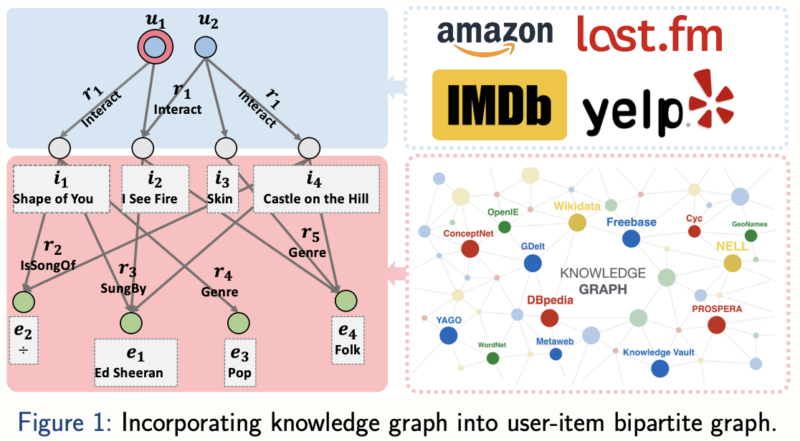 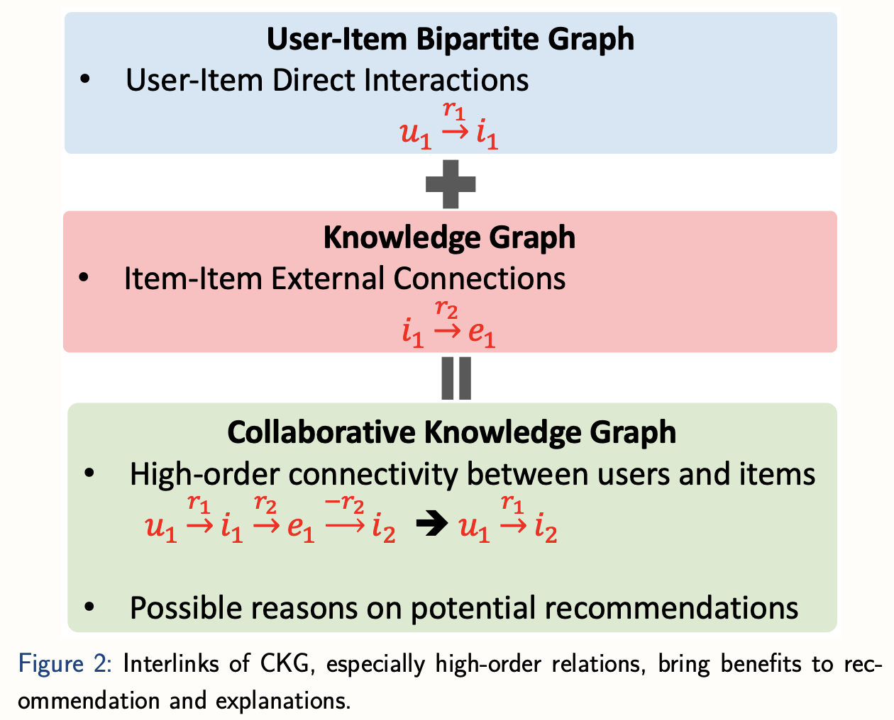

<!-- _footer: "http://staff.ustc.edu.cn/~hexn/slides/kdd19-KGAT-poster.pdf" -->
--- 
# Introduction
## Summary & Limitations of Three-type Works

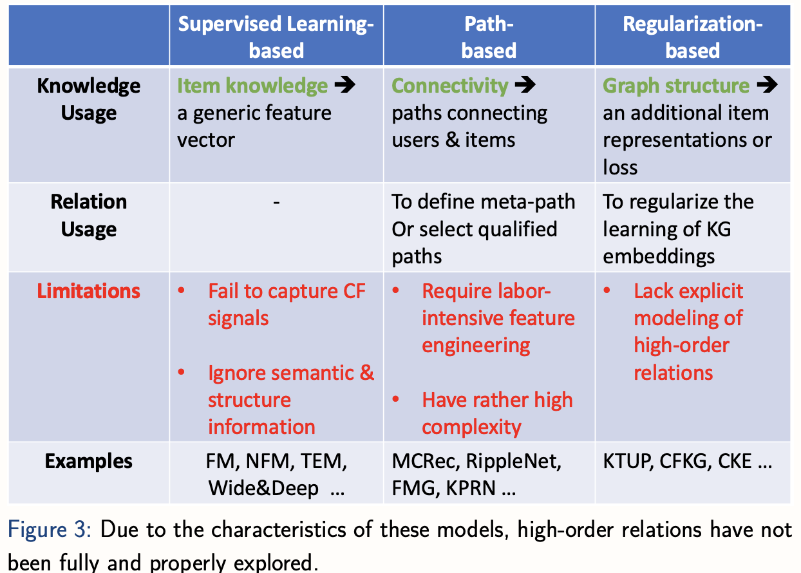

<!-- _footer: "http://staff.ustc.edu.cn/~hexn/slides/kdd19-KGAT-poster.pdf" -->

---

# Methodology
## Overview of KGAT

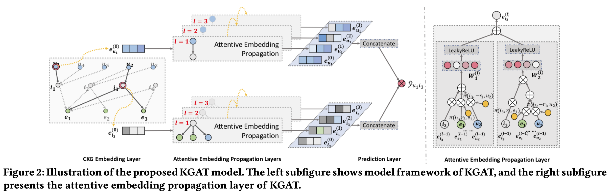

---

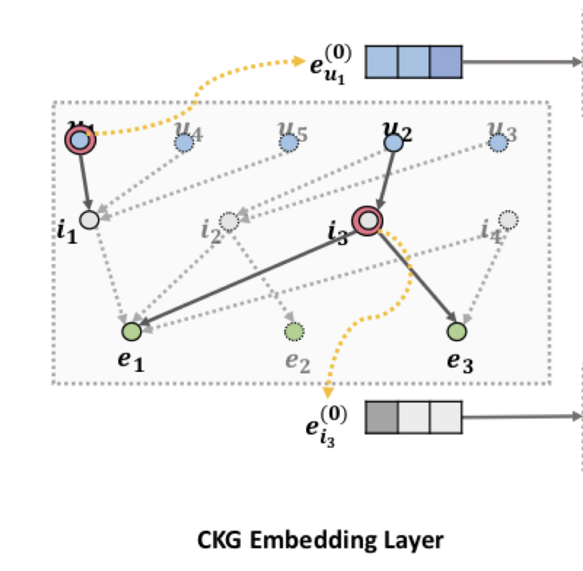
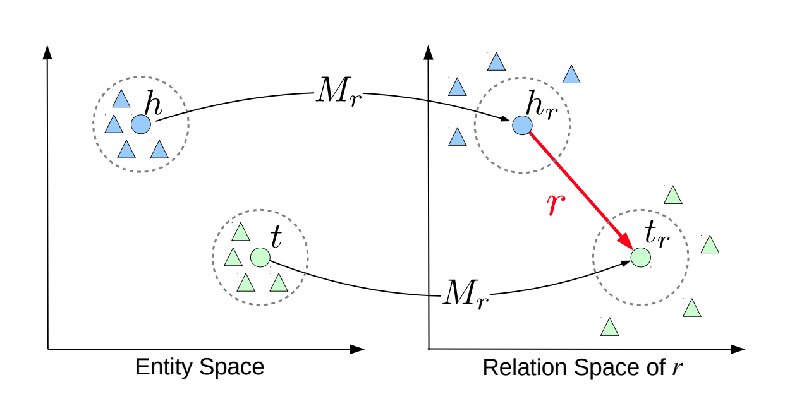

# Methodology

## CKG Embedding Layer

We adopt TransR to parameterize entities and relations of CKG as vector represetations, considering direct connectivity of each triple $(h,r,t)$:

$g(h,r,t) = \parallel W_re_h + e_r - W_re_t \parallel_2^2$.

Here, $W_r$ is the transformation matrix of relation $r$. $e_h$, $e_r$ and $e_t$ are embeddings for $h$, $r$ and $t$ respectively.

The loss function of TransR is:

$\mathcal{L}_{KG} = \sum_{(h,r,t,t')\in \mathcal{T}} - \ln \sigma(g(h,r,t') - g(h,r,t))$.

$\mathcal{L}_{KG}$ tries to maximize the discrimination between valid triplets and broken ones. $\sigma$ is sigmoid activation function. 

---

# Methodology
## Attentive Embedding Propagation Layer  1/2

1. **Information Propagation**: Perform information propagation between an entity $h$ and its neighbors $\mathcal{N}_h$

    $e_{\mathcal{N_h}} = \sum_{(h,r,t)\in\mathcal{N_h}} \pi(h,r,t)e_t$

    where $\pi(h,r,t)$ controls how much information being propagated from tail entity $t$ to head entity $h$ conditioned to relation $r$ .

2. **Knowledge-aware Attention**: Implement $\pi(h,r,t)$ via relational attention mechanism, which is formulated as follows:

    $\pi(h,r,t) = (W_r e_t)^{\top} tanh((W_r e_h + e_r))$.
    
    The value of $\pi(h,r,t)$ depends on the distance between $e_h$ and $e_t$ in relation $r$'s space.

---

# Methodology
## Attentive Embedding Propagation Layer  2/2
3. **Information Aggregation**: The final phase is to aggregate the entity representation $e_h$ and its ego-network representations $e_{\mathcal{N_h}}$ as the new representation of entity $h$ :

    $e_{h}^{(1)} = LeakyReLU(W_1(e_h + e_\mathcal{N_h})) + LeakyReLU(W_2(e_h \odot  e_\mathcal{N_h}))$

4. **High-order Propagation**: Further stack more propagation layers to explore the high-order connectivity information, gathering the information propagated from the higher-hop neighbors:

    $e_{\mathcal{N}_h}^{(l-1)} = \sum_{(h,r,t)\in\mathcal{N}_h} \pi(h,r,t)e_t^{(l-1)}$

---
# Methodology
## Model Prediction

1. After performing L layers, obtain multiple representations for user node $u$, namely $e^{(1)}_u, \cdots, e^{(L)}_u$:
$e^*_u = e^{(0)}_u \parallel \cdots \parallel e^{(L)}_u, e^*_i = e^{(0)}_i \parallel \cdots \parallel e^{(L)}_i$

2. Finally, conduct inner product of user and item representations, so as to predict their matching score:

    $\hat{y}(u,i) = e^*_u \top e^*_i$
    $\mathcal{L}_{CF} = \sum_{(u,i,j) \in \mathcal{O}} - \ln \sigma(\hat{y}(u,i) - \hat{y}(u,j))$

---

# Methodology
## Optimization
Finally, the objective function is the sum of the loss function $\mathcal{L}_{KG}$ and the loss function $\mathcal{L}_{CF}$, as follows:
$\mathcal{L}_{KGAT} =  \mathcal{L}_{KG} + \mathcal{L}_{CF}$

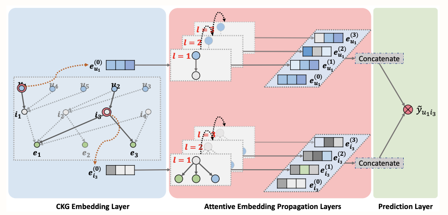

---

# Result
## Overall Performance Comparsion
- KGAT consistently yields the best performance on all the datasets.
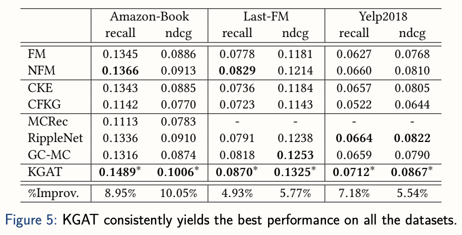

---

# Result
## Interaction Sparsity Levels
- Sparsity issue usually limits the expressiveness of recommender systems.
(The number on x axis mean the interaction numbers per user)

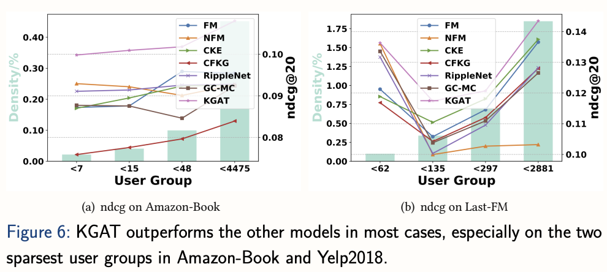

---

# Result
## Case Study for Explainable Recommendation
- Solid line in left subfigure from $u_{208}$ to $i_{4293}$, has the highest attention score. 
The explannation as *The Last Colony is recommended since you have watched Old Man's War written by the same author John Scalzi*

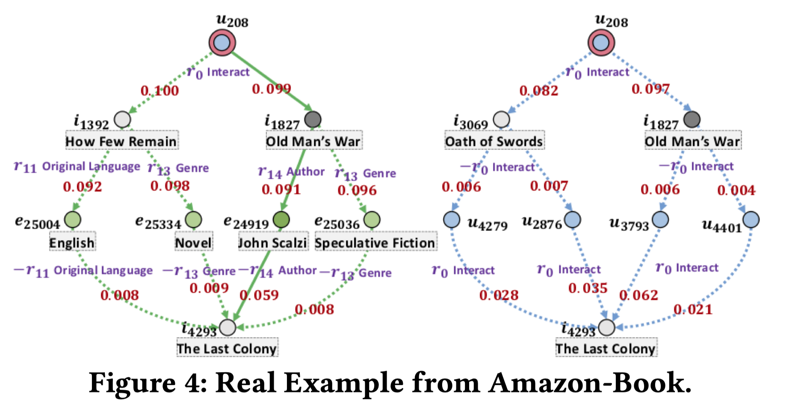

---
# Conclusion
## Conclusion
- High-order connectivity with semantic relations in CKG for knowledge-aware recommendation.
- Core: the attentive embedding propagation layer, which adaptively propagates the embeddings from a node's neighbors to update the node's representation.
- Extensive experiments on three real-world datasets demonstrate the rationality and effectiveness of KGAT.

---
# Coding Task
## Pull Request 
- Implements other models
- Trains other datasets
- Paper review documents update
- Dockerfile updates
- Bugs and fixes